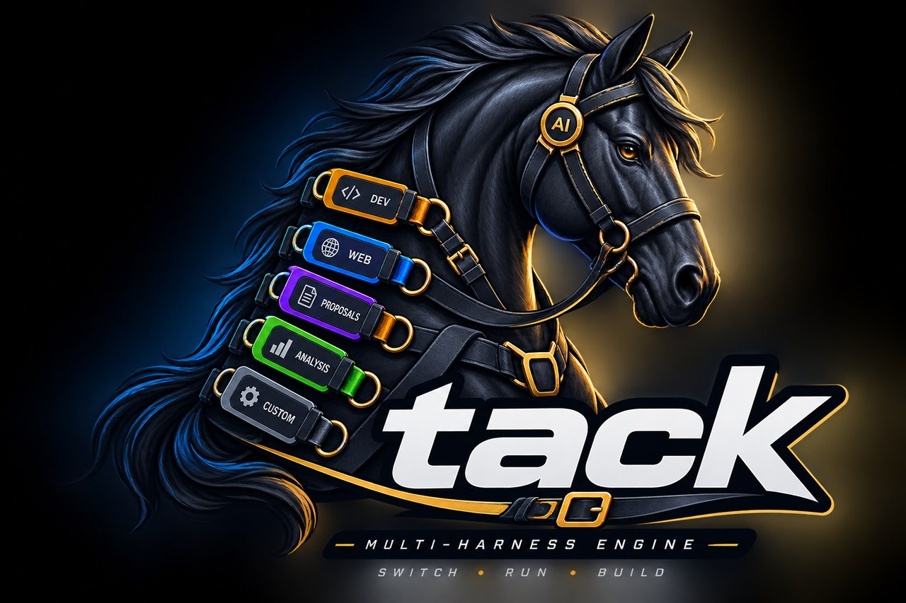
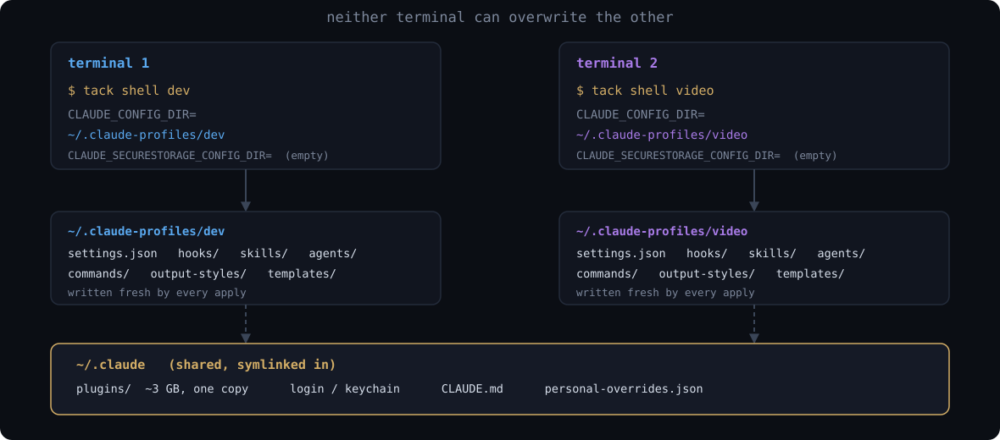

<p align="center">
  
</p>

<h1 align="center">tack</h1>

<p align="center"><b>Run a different Claude Code setup in every terminal.</b></p>

<p align="center">
  <a href="LICENSE"></a>
  <a href="../../actions/workflows/check.yml"></a>
  
</p>

<p align="center">
  
</p>

```bash
tack tmux dev      # terminal 1: engineering plugins, LSPs, security skills
tack tmux video    # terminal 2: different plugins, different MCP servers, different permissions
```

Both sessions share one login and one plugins tree. Neither can overwrite the
other's config. Switching is one command, and the whole setup is a git repo you
can hand to a teammate.

---

## Why

Everything enabled in Claude Code costs context on every single session. Plugins,
skills, MCP servers and hooks all load whether the current task needs them or
not. The usual answer is to enable a superset and live with the tax, or to toggle
things by hand and forget what you changed.

A **profile** is a recipe: a set of plugins, MCP servers, env vars, permissions
and settings, kept in a git repo. `tack use <name>` composes your config dir from
it. `tack shell <name>` does the same in an isolated config dir, so it only
affects that terminal.

What that buys:

- **Less context per session.** Load the eight plugins the work needs, not the
  forty you have installed.
- **Two kinds of work on one machine.** Frontend work wants Playwright and
  chrome-devtools MCP. Writing work wants neither and a stricter permission mode.
- **Reproducible across machines.** A profile repo pins the engine as a submodule,
  so every workstation converges on the same applied state. `tack sync` pulls,
  advances the pin, and re-applies.
- **Separation you can point at.** Client work and personal work in distinct config
  dirs with distinct permissions.

This is not a dotfiles sync tool. If all you want is one `~/.claude` mirrored
across machines, use [chezmoi](https://www.chezmoi.io/) or
[claude-code-dotfiles](https://github.com/elizabethfuentes12/claude-code-dotfiles).
tack is for running more than one setup.

---

## Walkthrough 1: install and apply your first profile

**Prerequisites:** bash, git, jq, python3, and the `claude` CLI. bash 3.2 is a
supported target, so macOS works without upgrading bash.

**Step 1.** Get the engine on your PATH.

```bash
git clone https://github.com/Mariano215/tack.git
cd tack
./setup-core.sh ~/Projects
```

```
harness root recorded: ~/Projects
installed tack -> ~/.local/bin/tack
tack aliases (claude-code) added to ~/.zshrc
done. Next: tack install <name>   (set HARNESS_ORG first)
```

This records where profile repos live and installs the `tack` command. **It does
not touch your config dir yet.**

**Step 2.** Read the warning below before continuing, then get a profile.

```bash
export HARNESS_ORG=your-github-account
# fork github.com/Mariano215/tack-profile-example to <your-account>/tack-dev first
tack install dev
```

**Step 3.** Confirm what you got.

```bash
tack status
```

```
active profile: dev
MCP servers:
  context7
enabled plugins: 6
```

### Read this before your first apply

`tack use` is destructive by design. It deletes and rewrites these directories in
your config dir:

```
hooks/  ghost/  agents/  commands/  templates/  scripts/  output-styles/
```

and moves any skill the profile does not declare into `skills-disabled/`.
`settings.json` is backed up to `.harness-prev-settings.json`. **The seven
directories above are not backed up.**

If your config dir already has content, the first apply stops rather than
proceeding:

```
apply-profile: ~/.claude already has content this apply would REPLACE:
  ~/.claude/hooks
  ~/.claude/commands
  Each is deleted and rewritten from the profile. Any skill the profile
  does not declare is moved to ~/.claude/skills-disabled.
  settings.json is backed up to .harness-prev-settings.json; the seven
  directories above are NOT.

  Fix: back them up first (cp -R ~/.claude ~/claude-backup), then
  re-run with --force.
  Type 'yes' to continue anyway:
```

Back up first if you have hand-written hooks or commands. To keep specific skills
across applies, list them one per line in `~/.claude/.harness-skills-keep`. Same
idea for marketplaces in `~/.claude/.harness-marketplaces-keep`.

### Optional shell aliases

Both are off by default, because both change how `claude` runs in every shell:

```bash
./setup-core.sh ~/Projects --no-api-key   # blank ANTHROPIC_API_KEY, forcing subscription auth
./setup-core.sh ~/Projects --yolo-alias   # point the alias at --dangerously-skip-permissions
```

`--no-api-key` is correct on a Max subscription and will break you if you pay by
API key.

---

## Walkthrough 2: two profiles in two terminals

This is the part no other tool does.

**Terminal 1:**

```bash
tack tmux dev
```

**Terminal 2:**

```bash
tack tmux video
```

Each command creates a config dir under `~/.claude-profiles/`, applies its
profile there, and opens a tmux session pointed at it. Run `claude` in either and
it sees only that profile's plugins, skills and MCP servers.

<p align="center">
  
</p>

`tack shell <name>` does the same without tmux, opening a subshell instead. Type
`exit` to return. It refuses to nest, so you cannot accidentally end up two
profiles deep.

Two details that matter:

- The `plugins/` tree is roughly 3 GB, so it is symlinked rather than copied. A
  per-profile copy would mean re-cloning every marketplace.
- `CLAUDE_SECURESTORAGE_CONFIG_DIR` is exported **empty**, which is the only value
  that maps back to your existing keychain entry. Any path there, including
  `~/.claude`, hashes to a second credential slot and asks you to log in again.

Delete an isolated profile at any time with `rm -rf ~/.claude-profiles/<name>`.

---

## Walkthrough 3: write your own profile

A profile repo is `tack-<name>`:

```
tack-dev/
├── manifest.json     what to enable
├── install.sh        three lines: update the submodule, run the apply
├── core/             this repo, as a git submodule
└── skills/           your skills, copied into the config dir on apply
```

**The manifest** is the whole configuration surface:

```json
{
  "name": "dev",
  "description": "Full-stack engineering",
  "plugins": {
    "superpowers@claude-plugins-official": true,
    "pyright-lsp@claude-plugins-official": true
  },
  "mcp": ["context7"],
  "env": { "SOME_FLAG": "1" },
  "permissions": { "defaultMode": "auto" }
}
```

**`install.sh`** never changes:

```bash
#!/usr/bin/env bash
set -euo pipefail
git submodule update --init --recursive
exec bash ./core/lib/apply-profile.sh ./manifest.json
```

Then `tack use dev` applies it. Edit the manifest, run it again, and the config
dir is recomposed from scratch. There is no partial state to reason about.

`scripts/scaffold-profiles.sh` generates this structure for you if you would
rather not build it by hand.

`profiles/` in this repo holds five working manifests you can copy: `dev`,
`minimal`, `proposal`, `video`, `web`. They ship with no skills, because skills
are yours; the profile is the recipe around them.

---

## Walkthrough 4: keeping several machines in sync

```bash
tack sync --push
```

For every profile repo it finds, this pulls with `--ff-only`, advances the
pinned engine submodule, commits the bump, optionally pushes, and then re-applies
whichever profile is active.

```
== tack-dev ==
  core pin bumped to ad246d1
  pushed 1 commit(s)
== tack-video ==
  pull is not a fast-forward, skipped (no pin bump on a stale base).
  Fix: cd ~/Projects/tack-video && git fetch && git log --oneline HEAD..origin/main
== not on GitHub ==
  tack-web: 2 uncommitted, 0 unpushed
== re-applying active profile: dev ==
```

It refuses to bump a pin onto a stale base, and it reports repos holding work
that a sync cannot carry, rather than reporting success and leaving them behind.

---

## Commands

| Command | What it does |
|---|---|
| `tack list` | Profiles found, with the active one marked |
| `tack use <name>` | Apply a profile to the current config dir |
| `tack shell <name>` | Apply into an isolated config dir and open a subshell there |
| `tack tmux <name>` | Same, wrapped in `tmux new -As <name>` |
| `tack herd <name>` | Same, as a Herdr workspace |
| `tack install <name>` | Clone `$HARNESS_ORG/tack-<name>` and apply it |
| `tack sync [--push]` | Pull every profile, advance its engine pin, re-apply the active one |
| `tack status` | Active profile, isolated config dirs, MCP servers, plugin count |

## Configuration

| Variable | Default | Purpose |
|---|---|---|
| `HARNESS_ORG` | unset | GitHub account `tack install` clones from |
| `HARNESS_PROFILE_PREFIX` | `tack-` | Profile repo name prefix |
| `HARNESS_ROOT` | `~/Projects` | Where profile repos live |
| `HARNESS_PROFILE_HOME` | `~/.claude-profiles` | Where isolated config dirs live |
| `HARNESS_ALIAS_NAME` | `claude-code` | Name of the convenience alias |
| `HARNESS_CORE_URL` | this repo | Engine source, for forks |
| `CLAUDE_CONFIG_DIR` | `~/.claude` | Config dir an apply writes to |

## Sharing profiles

Published profiles carry the [`tack-profile`](https://github.com/topics/tack-profile)
GitHub topic. [PROFILES.md](PROFILES.md) is a curated list, and a PR adds a row.

Installing someone else's profile runs their `install.sh` and can change your
agent's permission mode, hooks and MCP servers. Read
[PROFILES.md](PROFILES.md#read-this-before-installing-someone-elses-profile)
first, and try an unfamiliar profile with `tack shell <name>` so it lands in an
isolated config dir rather than your main one.

## What ships here

The engine (`bin/tack`, `lib/`, `hooks/`, `verify-setup.sh`), a set of
general-purpose skills (TDD, debugging, docs, security audit, prompt-injection
defense, code review, knowledge graphs), and `ghost`, a hook that blocks
LLM-tell phrasing in `.txt`, `.docx` and `.pdf` writes. Edit
`ghost/patterns.json` to make that list yours.

## Contributing

```bash
git add -A && bash scripts/check.sh
```

CI runs that plus `scripts/test-apply.sh`, which performs a real apply against a
throwaway config dir on both Linux and macOS. See `CLAUDE.md` for the invariants,
several of which exist because the thing they prevent has already shipped as a
bug.

## License

MIT. See [LICENSE](LICENSE).
